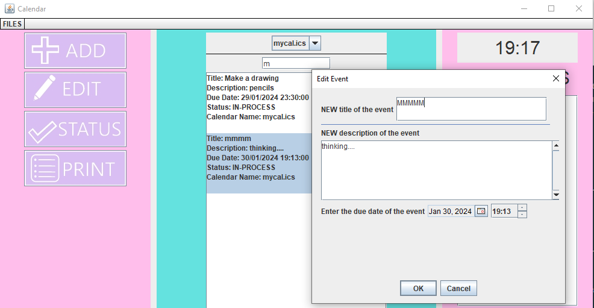

# <ins> How to use </ins>

## **RUN**
    java -jar  ProjectForJava2-1.0-SNAPSHOT.jar

- When you run the program this window should show up.

- Navigate to the "FILES" button on the menubar:

*Add calendar*  

This button will open a file navigator, that will let you choose a file you want to load
in the application. If you want to add another calendar repeat the same process. If you want to
create a new ICS file just write the name of it, in the File Name Section.

*Save Calendar*

This button will update the ICS files you have loaded with the changes you did on the app. 

<ins>Now that you have loaded or created the calendar files you need, you can use the functionalities of the application, that will be described below. </ins>

## FUNCTIONS

### ADD 

When you press the ADD button you are going to be prompted with 2 options:
- *Create appointment*
- *Create project*

When you press one of the two buttons and fill in the required information, then select one of the calendars
that you have already loaded to save the new event.To create the new event press the button Create.

Now you have created a new event in your ICS file. Save the file so the new event won't get lost!

### EDIT

When you press the EDIT button you are going to be prompted with an interface asking you for 2 things:
- *A calendar where the event you want to edit is in*
- *The title of the event you want to edit*

While you are searching the title of the event you want to change, you'll find the event below in the list.

By pressing on the event you want, you will be prompted an interface where you can edit the event.
Remember you have to save your changes in the menu in order for the file to be changed!

### STATUS (change project status)

Status function, works similarly with the edit function. When you press on a project the status changes.

### PRINT

By pressing the PRINT button you will be prompted with an interface where:
- *You are asked to select a number of calendars from the calendar you have already loaded*
- *The time period you want to see events from these calendars*

(To select multiple files, press ctrl and click on the desired files.)

### REMINDERS 

If an event ,that has been loaded either from a file or is created in the app, is within 30 minutes away from the current time, 
then it will appear in the Reminders panel. Also, when the event appears in the panel, a sound notification plays.

Also, the current time is shown on the top right side of the app.

## Addition Information

The ICS file should follow the correct format of an ICS file https://datatracker.ietf.org/doc/html/rfc5545 .
- You can use an external ICS file from Google calendar as an example.
- For the program to function properly the ICS file should have some properties for each
component (see documentation for ISCFile).
- All the information the program asks, is required, except for the "description" which is optional. The program will ask you to reenter the information
if there input is not valid.
- After adding and saving all your events, the app will save those events in the file with the events it already had (if
it had any).
- The program will terminate when you press X button.

# <ins>#collaborators</ins>

<li><em>George Oikonomou (it2022078) </em></li>

<li><em>Spyros Georgiou (it2022010) </em></li>

<li><em>Georgia Vrettakou (it2022009) </em></li>
